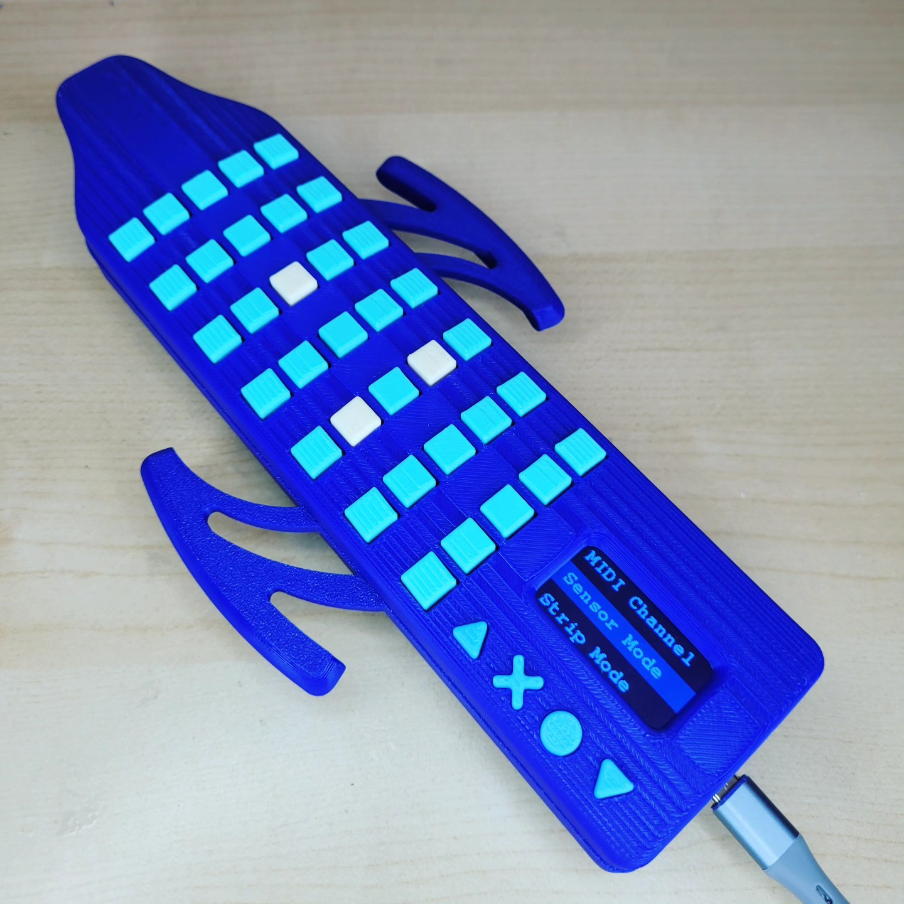

# MIDILodica

## What is the MIDILodica?

The MIDILodica is a breath-controlled, 3D printed, open-source MIDI device that features a pressure sensor, 35 reassignable note buttons, a softpot strip potentiometer, full menu navigation with a 320x172 screen, and underside button for additional MIDI and octave manipulation. This repository contains all the files needed to 3D print and manufacture the MIDILodica.

To accomplish this project, you will need:

- Basic knowledge of the Arduino IDE.
- Basic knowledge of and equipment for soldering.
- Access to a 3D printer.
- All the electronic parts listed below.

 

## Parts list

To build the MIDILodica, you will need the following:

- **40 x TL1105SPF160Q Tactile Switch** (can be substituted with TL1240NQ1JBLK if you don't have access to a 3D printer)
- **1x Adafruit 320x172 TFT Display - ST7789 (part no. 5393)** (with headers)
- **1x Arduino Micro** (with headers)
- **40x 1N4148 Through-hole diodes**
- **1x 10k through-hole resistor**
- **1x ABPDANT005PGAA5 Honeywell pressure sensor**
- **1x SEN-08680 50mm Softpot**
- **1x 66226-003LF 3pos clincher** (to replace the Softpot headers)
- **3x Male to Female jumper cables OR 1x 3pos Male to Female jumper cable**
- **1x 3pos right angle header** (to hold the sensor breakout board)
- **6x M2x20 screws** (for the housing)
- **4x M2x8 screws** (for the strip pot plate)

You will also need to obtain TWO printed circuit boards (PCB) with a PCB manufacturing service. The first one is the main board, which has all the buttons and breakout boards. The second PCB holds the sensor, and is attached at a 90 degree angle using the 3pos right angle header. The required files are in a .zip in the `/manufacturing/gerber` folder. If you wish to modify these boards, the `.sch` and `.brd` files are available in the `/manufacturing` folder.

 

## License

The project is under the GNU General Public License v3.0.
